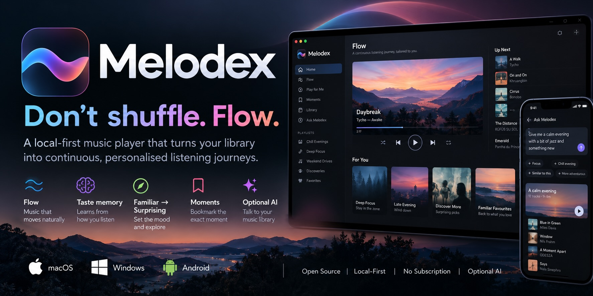

  

  <strong>Find your next listen in the music you already love.</strong>

  <a href="https://github.com/Cliff-Lee/melodex/releases/latest"><strong>Download Melodex</strong></a> ·
  <a href="docs/START_HERE.md">Get started</a> ·
  <a href="docs/WHY_MELODEX.md">Why Melodex?</a> ·
  <a href="docs/FAQ.md">FAQ</a> ·
  <a href="docs/README.md">Docs</a> ·
  <a href="docs/TESTING.md">Help test the beta</a>

# Melodex

## Don't shuffle. Flow.

Melodex is a music player that helps you find your way through your own collection. Start a listening session, keep it familiar or make it more adventurous, and rediscover albums you haven't heard in a while.

It works with music files you already have. Melodex leaves those files where they are, and you can use it without an account or an AI setup.

**Melodex may suit you if** you own music that has become hard to browse, keep returning to the same favourites, or want more say in where a listening session goes.

> **Project status:** public beta. The desktop app is the main supported experience; macOS has had the most hands-on testing so far, with packaged Windows and Linux builds also available. Android currently works as a Bridge client. Feedback from real music libraries is especially useful.

## What listening with Melodex feels like

- **Press Play something.** Start a session from your collection without first choosing every track.
- **Set the direction.** Choose Comfort, Explore, or Rediscover, then tune how familiar or surprising the session should feel.
- **Wander through your music.** Browse album artwork, explore a visual map, or build a journey from one part of your collection to another.
- **Keep what you like.** Use Keep and ♥ to help Melodex remember what you enjoy.
- **Use AI only if you want to.** Melodex works without any AI setup.

For more detail on the listening experience, see [Why Melodex?](docs/WHY_MELODEX.md).

## Get started

1. [Download the latest release](https://github.com/Cliff-Lee/melodex/releases/latest) for your device.
2. Open **My Music → + Add music** and choose a folder that contains your music.
3. Go to **Home** and choose **Play something**.

You don't need Python, Git, a server, or an AI model to install a release build. Melodex indexes and plays your files where they are; it does not move or copy your music.

| Platform | Install guide |
| --- | --- |
| macOS | [Install on macOS](docs/INSTALL_MACOS.md) |
| Windows | [Install on Windows](docs/INSTALL_WINDOWS.md) |
| Linux | [Install on Linux](docs/INSTALL_LINUX.md) |
| Android | [Android setup](docs/INSTALL_ANDROID.md) — currently pairs with a Melodex Bridge on a computer or home server |

Melodex does not include a subscription music catalogue. A local collection is the best way to use its listening and discovery features; supported connected sources are also available. See [the FAQ](docs/FAQ.md) for details.

## Try the beta

Melodex is still in public beta, and we're looking for everyday listeners. You don't need a huge collection or special expertise. The macOS build has had the most hands-on testing so far; Windows and Linux users are especially useful testers. Tell us what was easy, what confused you, whether anything failed, and whether Melodex gave you a reason to keep listening with it.

**[Follow the 10-minute tester guide](docs/TESTING.md)** · [Send beta feedback](https://github.com/Cliff-Lee/melodex/issues/new?template=tester_feedback.yml) · [Report a problem](https://github.com/Cliff-Lee/melodex/issues/new?template=bug_report.yml)

## Help and community

- [Start Here](docs/START_HERE.md) — install and play your first music.
- [FAQ](docs/FAQ.md) — accounts, AI, music sources, and privacy.
- [Troubleshooting](docs/TROUBLESHOOTING.md) — get help when something goes wrong.
- [Discussions](https://github.com/Cliff-Lee/melodex/discussions) — ask a question or share an idea.
- [Request a feature](https://github.com/Cliff-Lee/melodex/issues/new?template=feature_request.yml).

<strong>For developers and contributors</strong>

You can use Melodex without building it or knowing how it works internally. If you want to contribute, create an integration, or inspect the technical design, these are the right starting points:

- [Developer Gateway](docs/DEVELOPERS.md) — choose an app, provider, plugin, or API path.
- [5-minute developer quickstart](docs/DEVELOPER_QUICKSTART.md) — fastest route to a working extension/integration setup.
- [Status, stability and trust](docs/developers/00_STATUS_AND_STABILITY.md) — current maturity and compatibility expectations.
- [Ecosystem architecture](docs/developers/01_ECOSYSTEM_ARCHITECTURE.md) — how providers, plugins and external control fit together.
- [Build from source](docs/BUILD_FROM_SOURCE.md) — development environment and build instructions.
- [First contribution](docs/FIRST_CONTRIBUTION.md) — make a change to the project.
- [Provider SDK](provider-sdk/README.md) — create a music-source provider.
- [API documentation](docs/api/README.md) — REST, OpenAPI, MCP, and AI integrations.
- [Full documentation index](docs/ALL_DOCUMENTATION.md) — user and technical references.
- [Source and rights policy](docs/developers/11_SOURCE_AND_RIGHTS_POLICY.md) — requirements for external sources and extensions.

Melodex is open source under the [MIT licence](LICENSE). Music and media accessed through connected sources remain subject to those sources' terms and rights.

