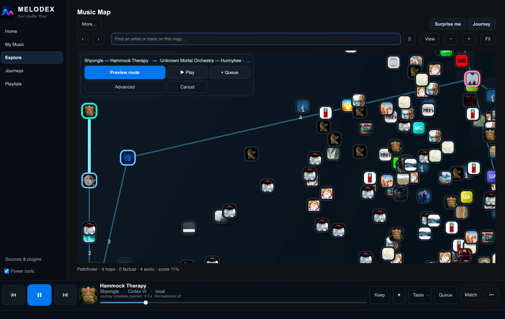
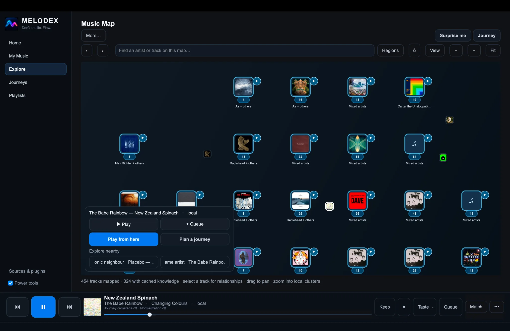
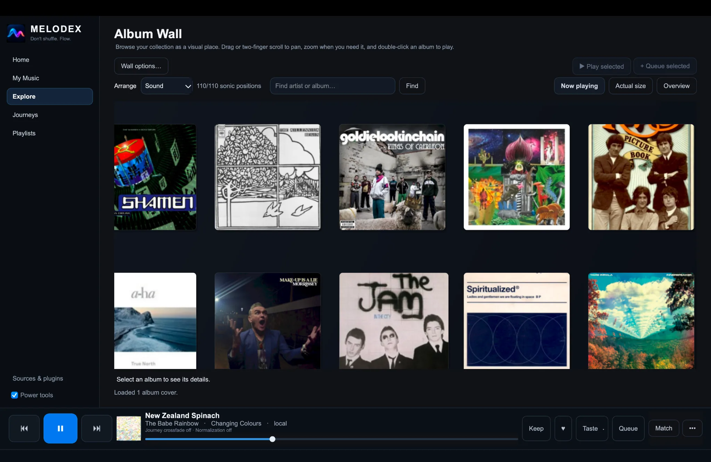
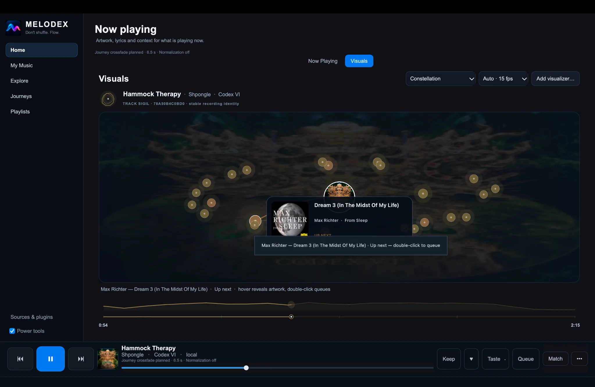
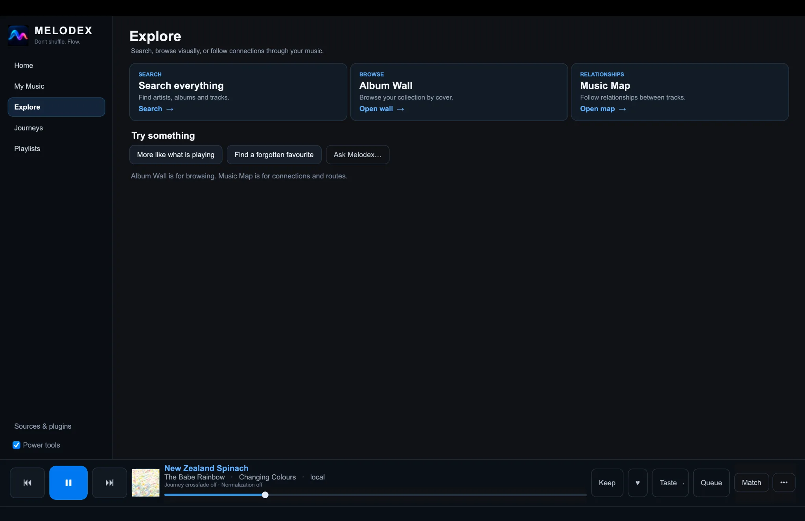
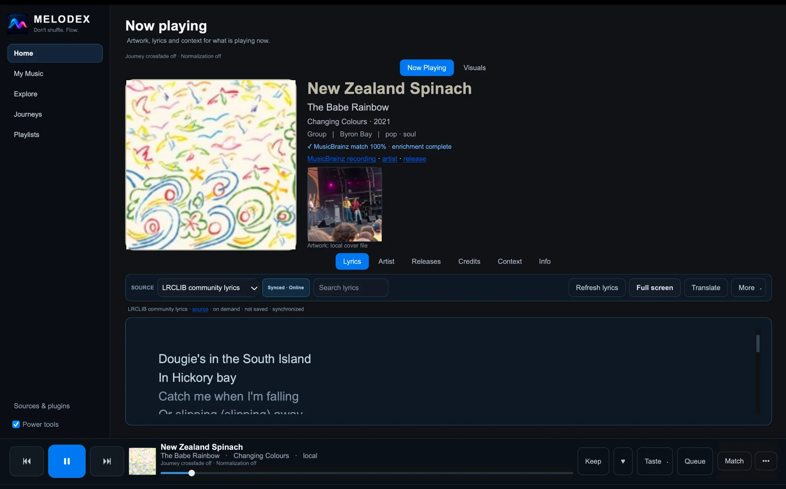

  

  <strong>Explore the music collection you already own.</strong>

  <a href="https://github.com/Cliff-Lee/melodex/releases/latest"><strong>Download Melodex</strong></a> ·
  <a href="docs/START_HERE.md">Get started</a> ·
  <a href="docs/WHY_MELODEX.md">Why Melodex?</a> ·
  <a href="docs/FAQ.md">FAQ</a> ·
  <a href="docs/README.md">Docs</a> ·
  <a href="docs/TESTING.md">Help test the beta</a>

# Melodex

Melodex is an **open-source, local-first music player for exploring your music collection, not just searching and playing it**.

Browse your library as a visual album wall, explore relationships between tracks on a music map, and rediscover what you own through listening journeys and interactive playback visuals.

Melodex works with music files you already have, leaves those files where they are, and does not require an account or an AI setup. Connected sources and optional AI controls are there if you want them, but they are not the centre of the experience.

> **Project status:** public beta. The desktop app is the main supported experience; macOS has had the most hands-on testing so far, with packaged Windows and Linux builds also available. Android includes standalone local playback with optional Provider Bridge connectivity. Feedback from real music libraries is especially useful.

## See your collection differently

Real screenshots from the running **v0.7.29 desktop app**. [Explore the full six-screen visual tour](docs/VISUAL_TOUR.md).

### Plan a route through your music

Choose a starting point and destination, preview a route of musical connections, and play or queue the result. Melodex distinguishes factual links from sonic suggestions; the displayed route score is a heuristic, not a promise of perfect recommendations.

### Navigate the Music Map

Pan and zoom through cover-art clusters, search for a track, and explore nearby music. The map is interactive, not just an illustration.

### Browse your albums visually

Browse by artwork, arrange by sound, and locate artists or albums without relying entirely on long lists.

### Discover music while it plays

Constellation offers another route to related tracks: inspect surrounding nodes and queue music without leaving playback.

### A simpler starting point, richer listening detail

  
  

Explore keeps search, artwork browsing and the map clearly separated. Now Playing provides cover art, recording context and lyrics, with more detail available when you want it.

## What you can actually do

- **Start with three clear paths.** Explore offers Search everything, Album Wall and Music Map rather than an overwhelming panel of settings.
- **Turn a map into a listening journey.** Pick tracks, preview a route of sonic/factual relationships, then play or queue the route. Its displayed score is a route heuristic, not a quality guarantee.
- **See details while music plays.** Now Playing combines large artwork, optional MusicBrainz context, lyrics, releases and credits.
- **Navigate through visuals.** The Constellation view surfaces related music as interactive nodes you can inspect and queue.
- **Keep control accessible.** A persistent player provides transport and queue controls across pages.

[Walk through the current desktop experience →](docs/VISUAL_TOUR.md)

## Why Melodex is different

- **Browse visually.** Album Wall turns a large collection into something you can scan and wander through.
- **Explore relationships.** Music Map reveals connections between tracks and lets you move through the library spatially.
- **Follow a path instead of shuffling.** Choose Comfort, Explore, or Rediscover, tune how familiar or surprising the session should feel, or build a journey between parts of your collection.
- **Make playback part of discovery.** Interactive visuals such as Constellation keep nearby music within reach while a track is playing.
- **Keep your library yours.** Local files stay where they are. No account, subscription catalogue, server, or AI model is required.

For more detail on the listening experience, see [Why Melodex?](docs/WHY_MELODEX.md).

## Get started

1. [Download the latest release](https://github.com/Cliff-Lee/melodex/releases/latest) for your device.
2. Open **My Music → + Add music** and choose a folder that contains your music.
3. Go to **Home** and choose **Play something**.

You don't need Python, Git, a server, or an AI model to install a release build. Melodex indexes and plays your files where they are; it does not move or copy your music.

| Platform | Install guide |
| --- | --- |
| macOS | [Install on macOS](docs/INSTALL_MACOS.md) |
| Windows | [Install on Windows](docs/INSTALL_WINDOWS.md) |
| Linux | [Install on Linux](docs/INSTALL_LINUX.md) |
| Android | [Android setup](docs/INSTALL_ANDROID.md) — play local phone music or connect to a Melodex Bridge |

> **macOS first-launch security notice:** Current Mac release builds are not Apple Developer ID signed or notarized. macOS may block the first launch. Read the [Mac installation and Privacy & Security instructions](docs/INSTALL_MACOS.md#3-macos-security-warning-unsigned-public-beta) before approving an app-specific exception. **Do not disable Gatekeeper globally.** See the [Privacy Policy](docs/PRIVACY.md) and [Security](SECURITY.md) for details.

Melodex does not include a subscription music catalogue. A local collection is the best way to use its listening and discovery features; supported connected sources are also available. See [the FAQ](docs/FAQ.md) for details.

## Try the beta

Melodex is still in public beta, and we're looking for everyday listeners. You don't need a huge collection or special expertise. The macOS build has had the most hands-on testing so far; Windows and Linux users are especially useful testers.

If you try it, tell us what was easy, what confused you, whether anything failed, and most importantly whether Melodex gave you a reason to explore something in your collection that you might otherwise have ignored.

**[Follow the 10-minute tester guide](docs/TESTING.md)** · [Send beta feedback](https://github.com/Cliff-Lee/melodex/issues/new?template=tester_feedback.yml) · [Report a problem](https://github.com/Cliff-Lee/melodex/issues/new?template=bug_report.yml)

## Help and community

- [Start Here](docs/START_HERE.md) — install and play your first music.
- [FAQ](docs/FAQ.md) — accounts, AI, music sources, and privacy.
- [Troubleshooting](docs/TROUBLESHOOTING.md) — get help when something goes wrong.
- [Discussions](https://github.com/Cliff-Lee/melodex/discussions) — ask a question or share an idea.
- [Request a feature](https://github.com/Cliff-Lee/melodex/issues/new?template=feature_request.yml).

<strong>For developers and contributors</strong>

You can use Melodex without building it or knowing how it works internally. If you want to contribute, create an integration, or inspect the technical design, these are the right starting points:

- [Developer Gateway](docs/DEVELOPERS.md) — choose an app, provider, plugin, or API path.
- [5-minute developer quickstart](docs/DEVELOPER_QUICKSTART.md) — fastest route to a working extension/integration setup.
- [Status, stability and trust](docs/developers/00_STATUS_AND_STABILITY.md) — current maturity and compatibility expectations.
- [Ecosystem architecture](docs/developers/01_ECOSYSTEM_ARCHITECTURE.md) — how providers, plugins and external control fit together.
- [Build from source](docs/BUILD_FROM_SOURCE.md) — development environment and build instructions.
- [First contribution](docs/FIRST_CONTRIBUTION.md) — make a change to the project.
- [Provider SDK](provider-sdk/README.md) — create a music-source provider.
- [API documentation](docs/api/README.md) — REST, OpenAPI, MCP, and AI integrations.
- [Full documentation index](docs/ALL_DOCUMENTATION.md) — user and technical references.
- [Source and rights policy](docs/developers/11_SOURCE_AND_RIGHTS_POLICY.md) — requirements for external sources and extensions.

Melodex is open source under the [MIT licence](LICENSE). Music and media accessed through connected sources remain subject to those sources' terms and rights.

