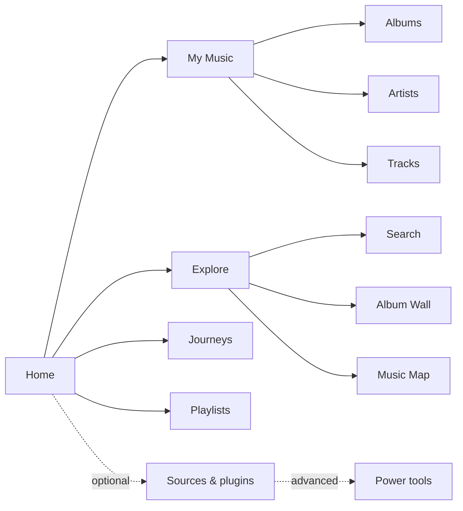
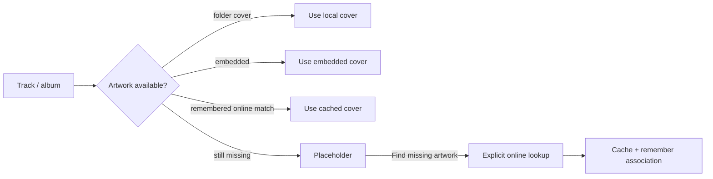
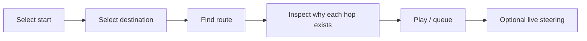
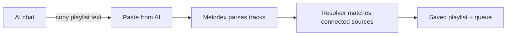

# Melodex: a 5-minute visual tour

This tour reflects the **v0.7 desktop experience**.

Melodex is designed to feel like a music player first. Deeper routing, provider and plugin controls remain available when you want them.

## 1. The main map



The sidebar deliberately shows listener goals rather than every Melodex subsystem.

## 2. Add your music

Open **My Music** and choose:

> **+ Add music**

Choose a folder containing music you are authorised to play.

Melodex indexes those files in place. It does not need to move or upload them.

```text
My Music
├── Albums   ← default visual view
├── Artists
└── Tracks
```

## 3. Browse the collection

Albums are shown as a responsive artwork grid.

Melodex first looks for local artwork:



If an explicit online lookup finds a cover, leaving My Music and returning should **not** make it disappear.

## 4. Artists are visual too

Switch to **Artists**.

Each card uses:

1. a remembered artist photo when available;
2. otherwise a representative album cover;
3. otherwise a deterministic placeholder.

Choose **Find artist photos** when you explicitly want Melodex to try online metadata sources.

Double-click or choose **View** to move back into that artist's albums.

## 5. Tracks stay recognisable

Switch to **Tracks**.

Each track row includes its album artwork, title, artist and album context.

```text
┌──────┐  Ice Sold Here
│cover │  Aesop Rock · Black Hole Superette
└──────┘

        ▶ Play    + Queue    Edit
```

If the artist is missing, Melodex marks the row **Needs artist**.

Choose **Edit** to correct local metadata inside Melodex.

The correction survives rescans but **does not rewrite the original audio file**.

See [My Music](MY_MUSIC.md).

## 6. Start listening from Home

Home begins with intent rather than configuration:

```text
What do you feel like hearing?

[ ▶ Play something ]

[ Comfort ] [ Explore ] [ Rediscover ]          [ Tune it… ]
```

You do not need to understand Flow first.

**Tune it…** reveals session length, listening style and Familiar ↔ Adventurous controls when you want them.

## 7. Continue listening

Home also keeps a visual **Continue listening** card for the most recent track.

The persistent player remains visible across the app and acts as the route into **Now Playing**.

## 8. Now Playing and Visuals

Click the current track in the persistent player.

The default **Now Playing** view prioritises:

- artwork;
- track / artist / album identity;
- lyrics and context where available.

Optional generative and analytical scenes live under **Visuals**.

Visual work uses cached analysis where possible and does not need to analyse the audio again during playback.

## 9. Explore

**Explore** reduces discovery to three understandable choices:

```text
Search everything     Album Wall        Music Map
direct search         visual browsing   relationships/routes
```

There are also shortcuts such as:

- **More like what is playing**
- **Find a forgotten favourite**
- **Ask Melodex…** (optional LLM)

## 10. Album Wall

Album Wall turns the collection into a stable visual place rather than an alphabetical list.

Use different lenses:

- **Sound**
- **Familiarity**
- **Time**
- **A–Z shelves**

You can pan, zoom, search, select an album and play or queue it.

Sound placement reuses cached Flow analysis. Albums without analysis remain visible at deterministic fallback positions.

See [Album Wall](ALBUM_WALL.md).

## 11. Music Map

Music Map answers a different question:

> **How are these tracks related?**

The default map is for browsing.

When you choose **Plan a route…**, Melodex reveals the deeper Pathfinder / Journey controls.



Advanced route controls are also available through **Power tools**.

## 12. Journeys

A Journey is a listening route that changes gradually instead of shuffling randomly.

**Saved journeys** remember the design idea.

**Recent runs** remember privately what actually happened after skips, steering and replanning.

Empty Journey pages explain the first useful action instead of presenting an unexplained blank list.

## 13. Playlists and AI handoff

Open **Playlists → Paste from AI…** to bring in a playlist created in ChatGPT, Claude, Gemini or another chat system.

This is a copy-and-paste workflow:



No AI account needs to be connected to Melodex.

See [Playlist interchange](PLAYLIST_INTERCHANGE.md).

## 14. Sources & plugins

Most listeners do not need this page first.

Use **Sources & plugins** when you want to:

- add another local folder;
- add your own stream URLs;
- explore optional plugins;
- configure a source.

Enable **Power tools** only when you need provider priority, diagnostics, manual package installation, Provider Bridge or other technical controls.

## 15. Teach Melodex your taste

A few signals are enough:

- **♥** — strong positive signal;
- **Keep** — this belongs in my musical world;
- finishing tracks — useful positive evidence;
- early skips — useful negative evidence.

A single skip is not treated as a permanent judgement.

Taste history stays local.

## Where next?

- [Start Here](START_HERE.md)
- [My Music](MY_MUSIC.md)
- [Full user guide](USER_GUIDE.md)
- [Why Melodex?](WHY_MELODEX.md)
- [Album Wall](ALBUM_WALL.md)
- [Music Map](MUSIC_MAP.md)
- [Install Melodex](INSTALL.md)
