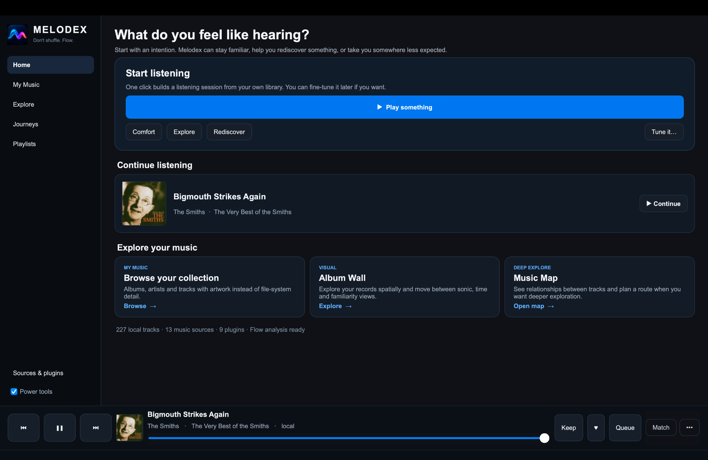
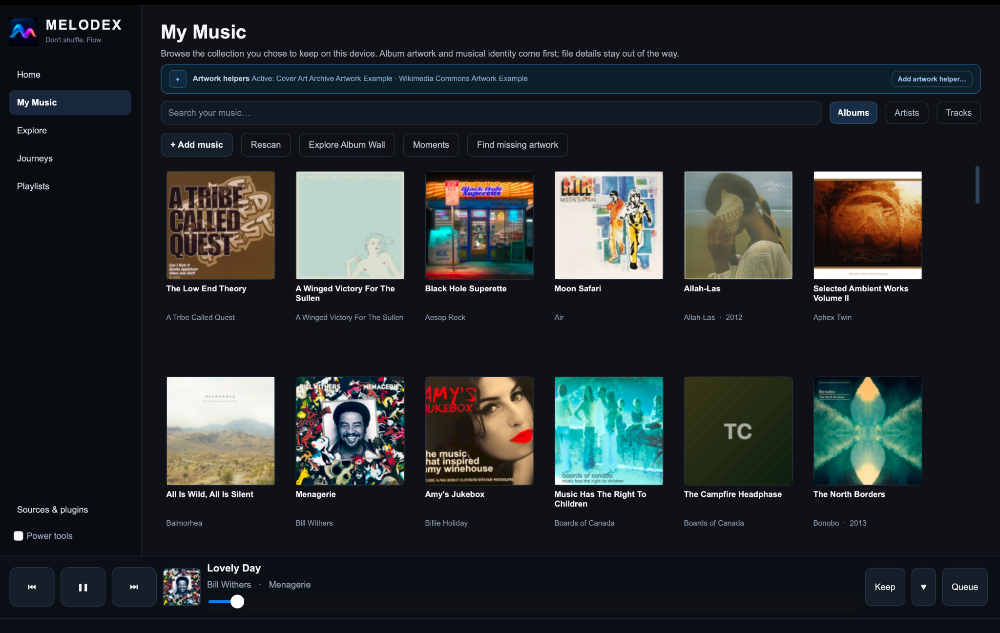
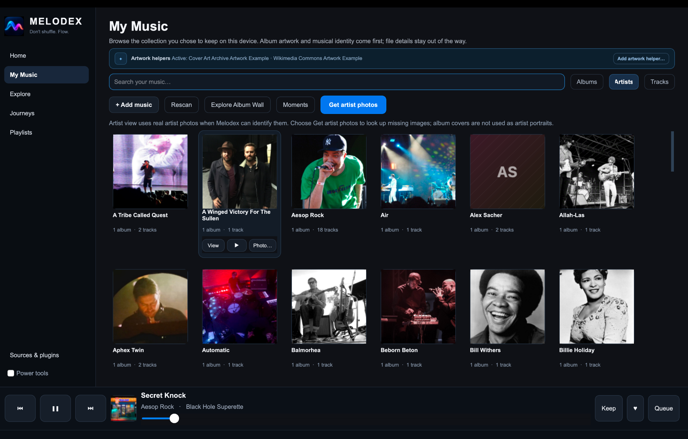

# Melodex visual tour

This tour shows the desktop v0.7.2 experience.

## Start at Home

Choose **Play something** to start a balanced session. **Comfort**, **Explore**, and **Rediscover** change its direction; **Tune it…** gives you a little more control. The persistent player stays at the bottom of the window.

## Add and browse your music

Open **My Music → + Add music** to choose a folder. Your audio stays where it is.

Albums are shown with their artwork. Choose **Find missing artwork** when covers are missing.

Choose **Get artist photos** to look for portraits. Melodex uses a neutral placeholder when it cannot find a suitable photo; it does not present album covers as artist portraits.

## Open Now Playing

Select the current track in the persistent player. In **Lyrics**, synchronized words follow the track and can be used to seek. **Source**, **Refresh lyrics**, and **Full screen** are ready to use; **Translate** is optional and requires a configured language model.

## Explore further

Open **Explore** to search connected sources, browse your albums in **Album Wall**, or view local track relationships in **Music Map**. Album Wall and Music Map keep their deeper controls in their own options. Read the [Album Wall guide](ALBUM_WALL.md) and [Music Map guide](MUSIC_MAP.md) for the full tour.

## Keep the setup simple

You can listen without connecting AI or changing advanced settings. **Playlists → Paste from AI…** is only a copy-and-paste option: Melodex reads the list locally and searches your connected music sources for matches.

Continue with the [Start Here guide](START_HERE.md), or use the [full user guide](USER_GUIDE.md).
