# Melodex: a 5-minute visual tour

This tour uses the v0.2 interface.

## 1. Home

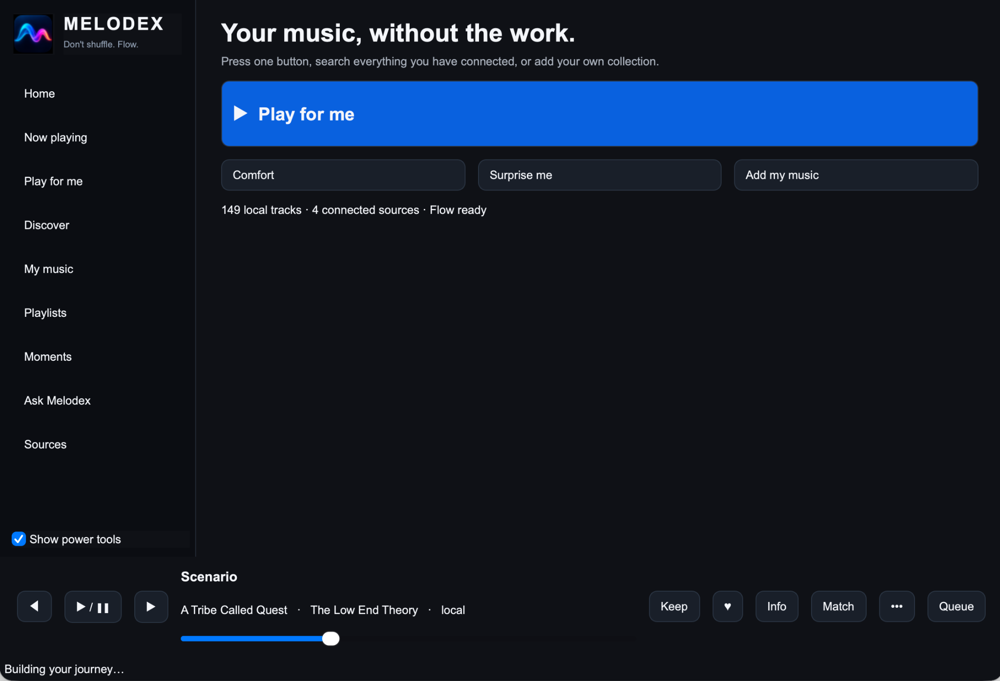

The Home page keeps the first decision simple: **Play for me**, choose Comfort, ask for a surprise, or add music.

## 2. Add and browse your music

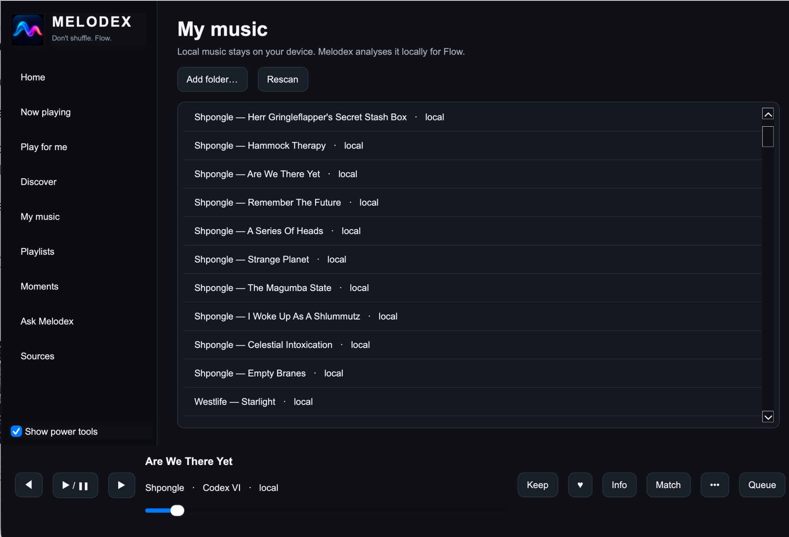

Open **My music** and add a folder. Melodex indexes your files in place; it does not need to move the originals.

## 3. Play for Me

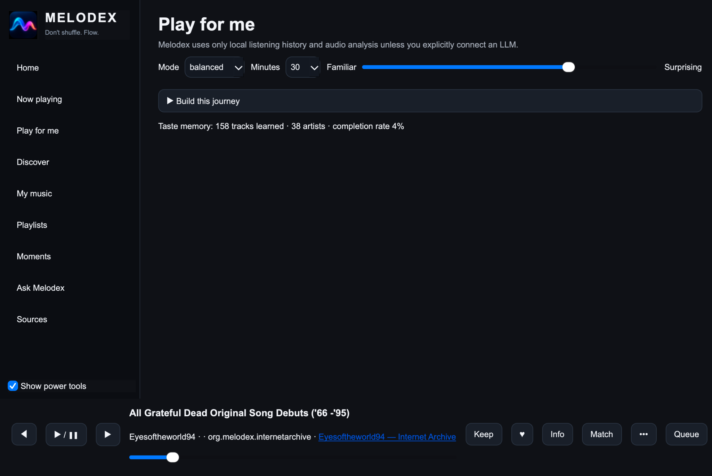

Choose a mode, a session length and where you want to sit on **Familiar - Surprising**.

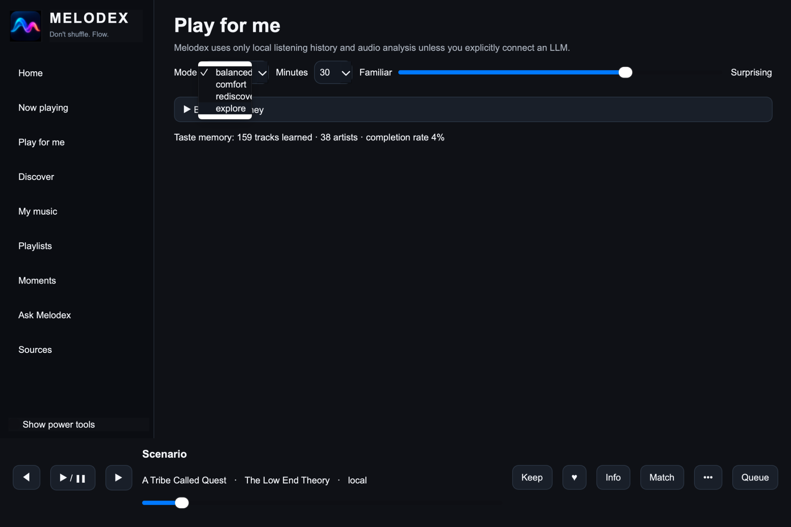

Balanced, Comfort, Rediscover and Explore give the same engine different intentions.

## 4. Discover across sources

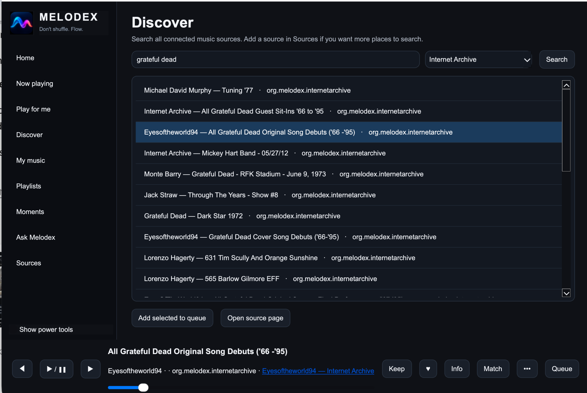

Discover can search all connected sources or one selected source. Results can be played immediately or added to the current queue.

## 5. Music sources

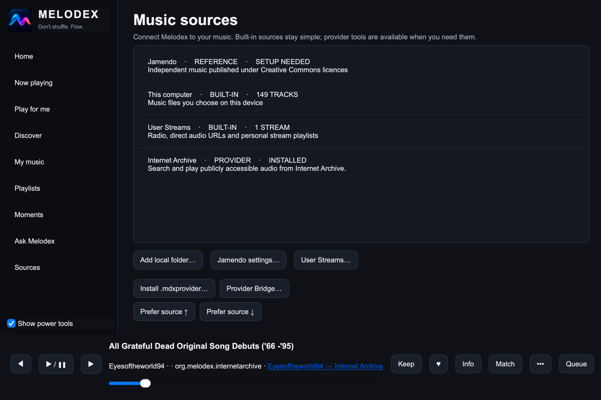

v0.2 can combine local files, User Streams, Jamendo, Internet Archive and compatible third-party providers.

## 6. User Streams

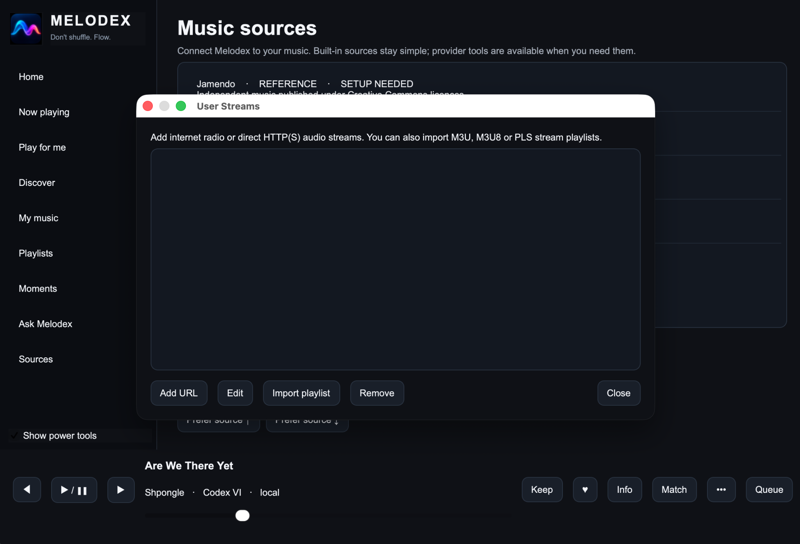

User Streams accepts direct HTTP(S) audio/radio URLs and can import M3U, M3U8 and PLS stream playlists.

## 7. Rich Now Playing

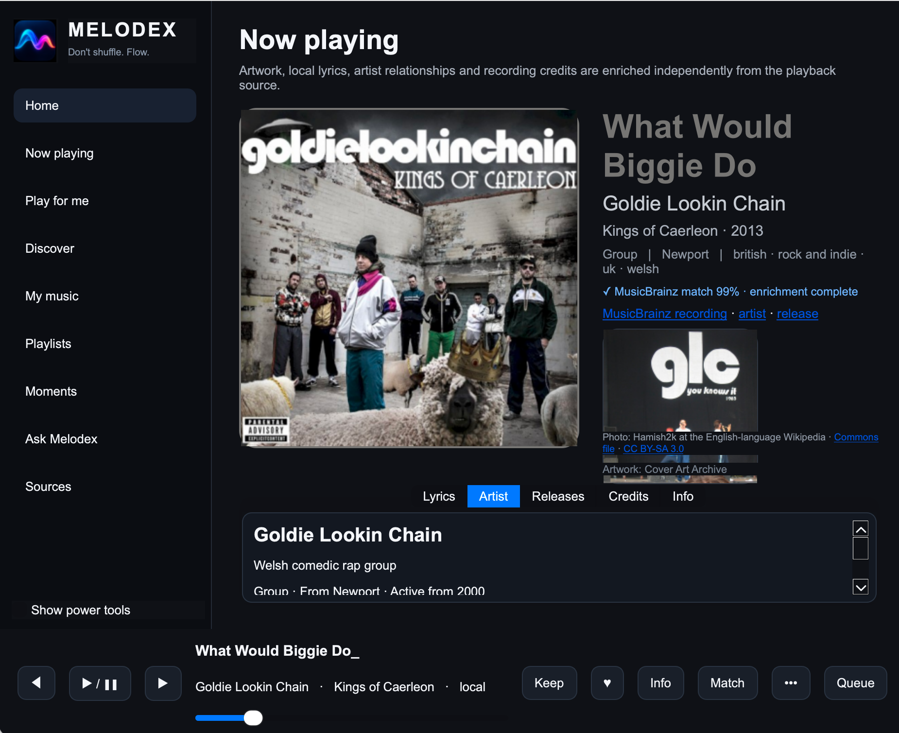

Playback and music knowledge are separate. Melodex can enrich the track with artwork, MusicBrainz identity, artist relationships, credits, release information and local lyrics.

## 8. Playlists

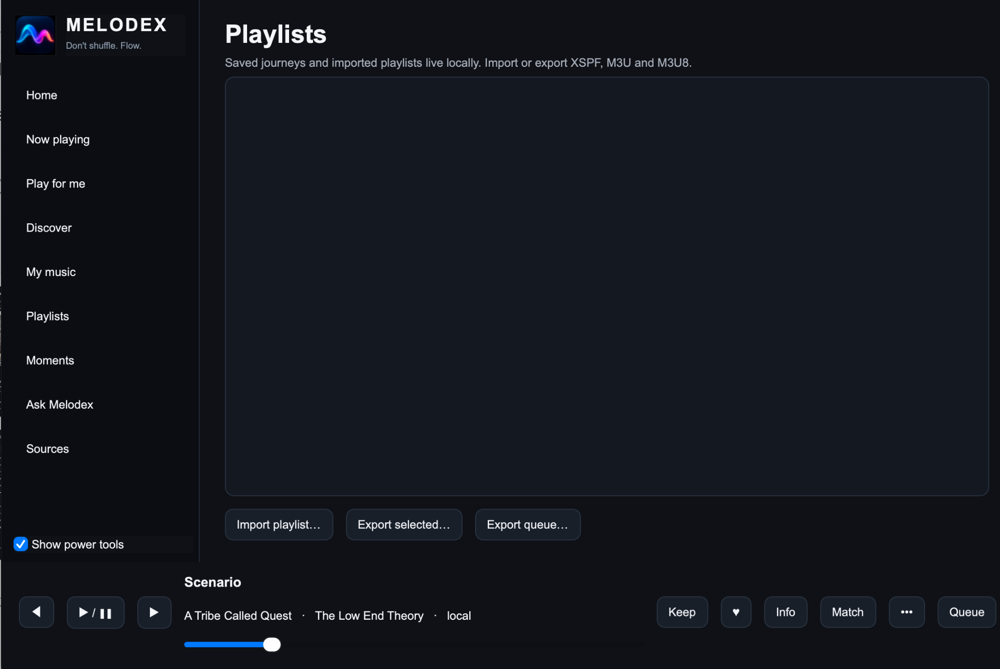

Melodex imports and exports XSPF, M3U and M3U8. Metadata-only entries can resolve against whatever sources are connected on the current device.

## 9. Moments

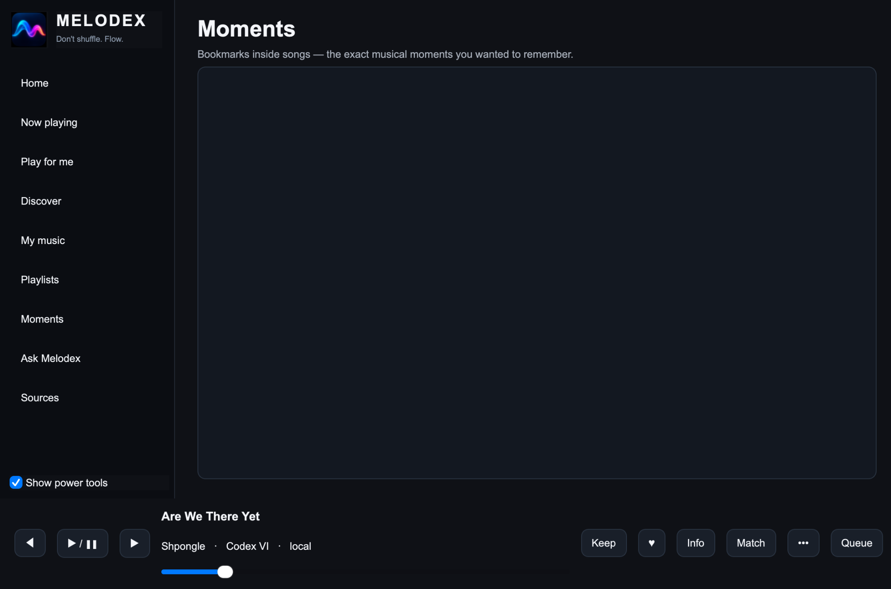

A Moment is a bookmark inside a track: a lyric, drop, solo, transition or other point you want to return to.

## 10. Ask Melodex

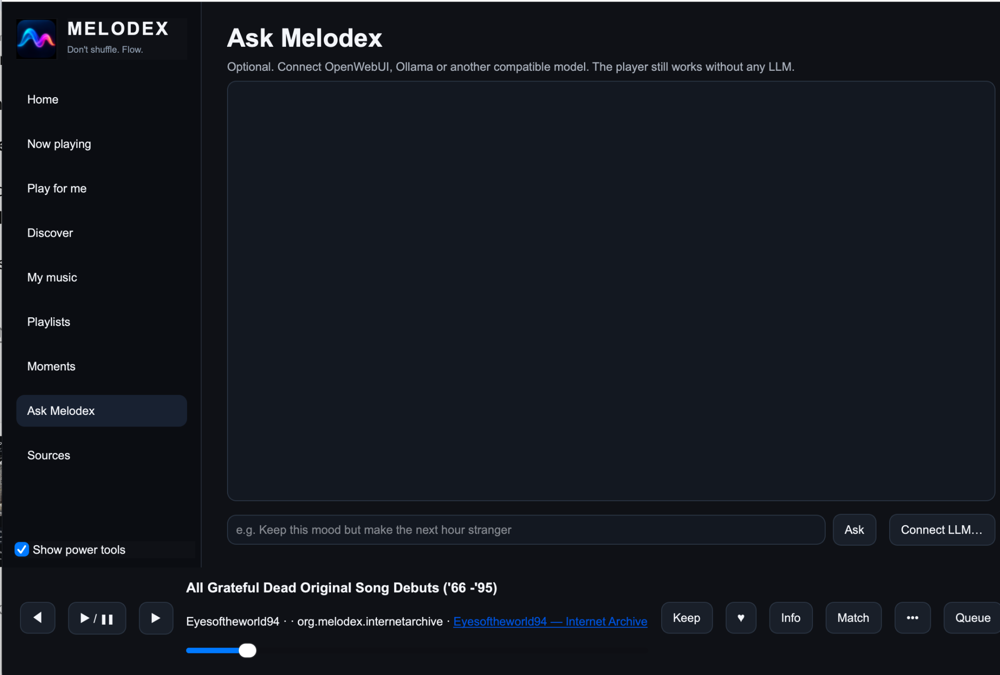

LLM support is optional. Connect Ollama, OpenWebUI or another compatible model if you want natural-language control.

## Where next?

- [User Manual PDF](manuals/Melodex_User_Manual_v0.2.pdf)
- [Power User Manual PDF](manuals/Melodex_Power_User_Manual_v0.2.pdf)
- [Start Here](START_HERE.md)
- [Sources](SOURCES.md)
