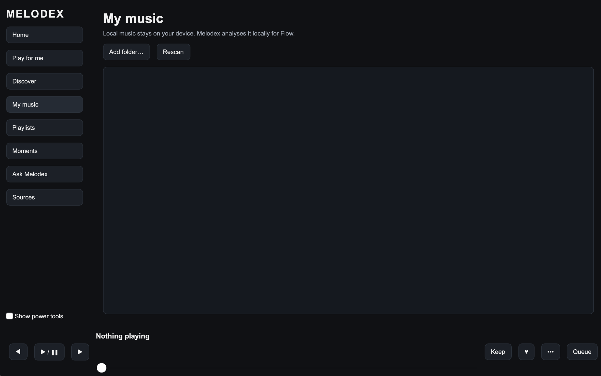
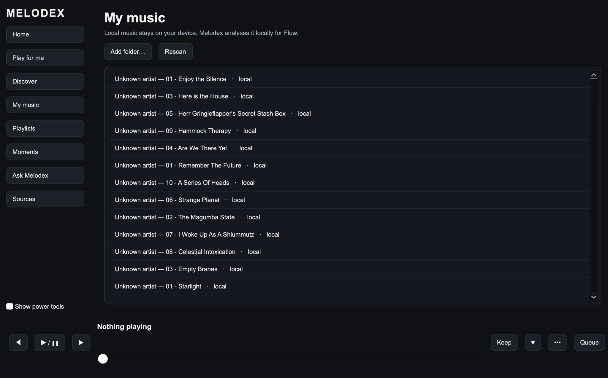
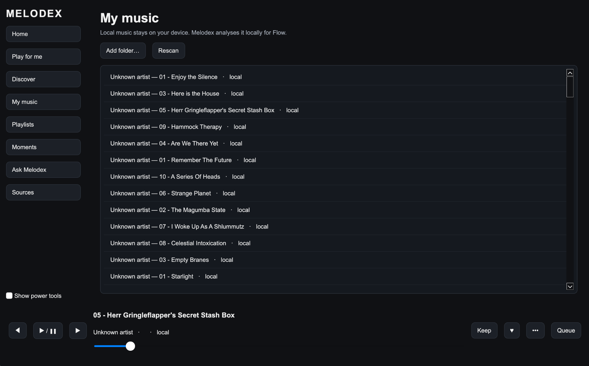
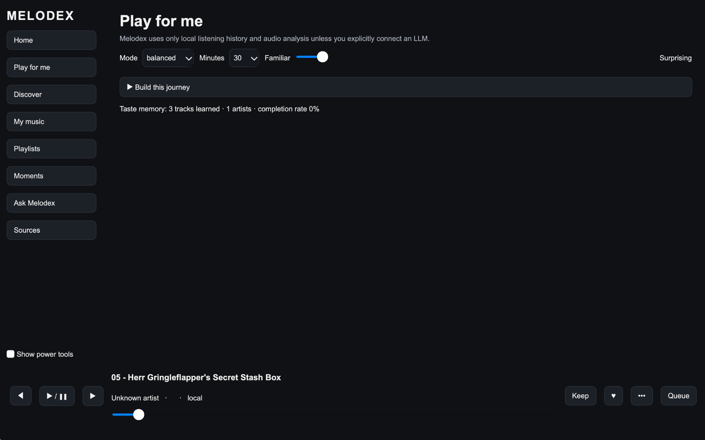
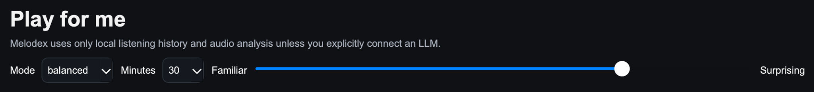
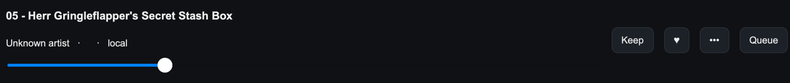
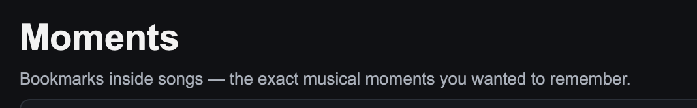
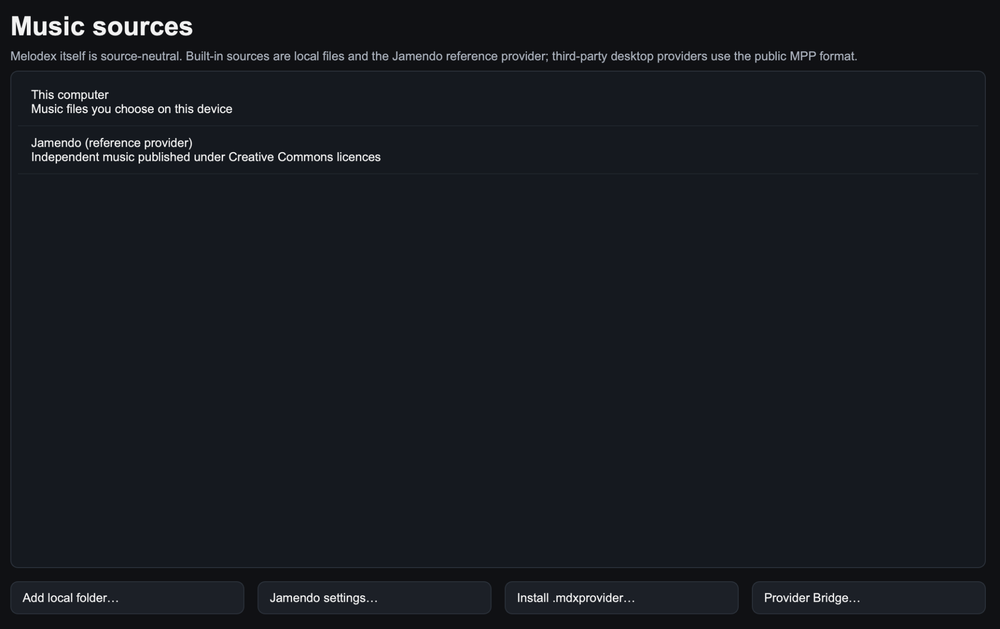
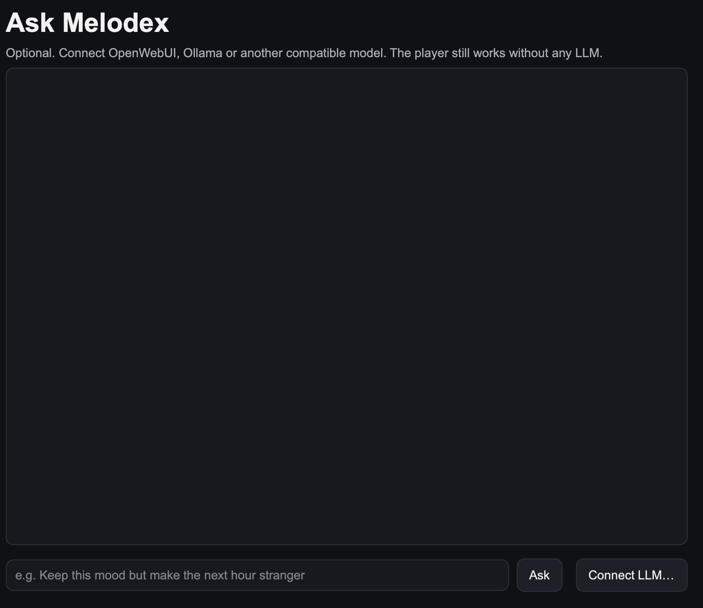

# Melodex: a 5-minute visual tour

This is the fastest way to understand Melodex.

## 1. Add your music

Before local music is indexed, **My music** can look like this:

To add music, open **Sources** and choose **Add local folder…**.

Select a folder containing music you are authorised to play. Melodex indexes the files in place; it does not need to move your originals.

Then return to **My music** to browse the indexed library.

**My music** also has an **Add folder…** shortcut to the same folder picker. The Sources route is used throughout the documentation because it is also where online sources, streams and plugins are managed.

## 2. Browse your library

Once indexed, your tracks appear in **My music**.

You can use Melodex as a normal player: select a track, play it, add things to the queue and browse your collection.

The interesting part starts when you let Melodex help shape the session.

## 3. Play for me

**Play for me** asks three simple questions:

1. What kind of session do you want?
2. How long should it be?
3. How familiar or surprising should it feel?

The player uses local taste memory and available analysis to construct the journey.

## 4. Familiar ↔ Surprising

Move toward **Familiar** when you want comfort and stronger known-positive signals.

Move toward **Surprising** when you want Melodex to take more chances.

This is not a permanent preference. It describes what you want *right now*.

## 5. Teach Melodex your taste

A few signals are enough:

- **♥ Love** — strong positive feedback.
- **Keep** — this belongs in my musical world.
- **Finish the track** — useful positive evidence.
- **Skip early** — useful negative evidence.
- **Return later** — evidence that the track mattered.

A single skip is not treated as a permanent judgement. Context matters.

## 6. Flow, not shuffle

Shuffle asks:

> What random track comes next?

Flow asks:

> **What track makes sense after this one?**

When local audio analysis is available, Melodex can consider musical characteristics such as tempo, energy, key, loudness, timbre and structure.

Flow then tries to order the queue so the movement between tracks feels more deliberate.

A future version of this tour will show the same queue **before and after Flow** side-by-side.

## 7. Music map

Open **Music map** after some local tracks have Flow analysis.

The map is a zoomable local sonic landscape: nearby dots share similar Flow features. Change the colour mode to look at energy, taste memory or rediscovery potential.

The separate **Connections** selector lets the same fixed map answer a different question. Use **Sounds similar · Flow** for sonic-neighbour edges, or **Actually connected · all** for cached factual links such as common artists, producers, performers, works, samples/remixes and recording places.

Select a mapped track to play it, queue it, or choose **Start journey here**. That turns visual exploration back into a normal Melodex listening session.

For a more deliberate route, use **Pathfinder**: set a start and destination, choose Balanced/Sonic/Knowledge-first, then inspect the numbered route and the reason for every hop before playing or queueing it.

**Journey Designer** goes one step further: add semantic stages such as Calm, Darker, Forgotten or Energetic—or an exact selected-track waypoint—and Melodex will build a staged route through them. The included first preset is **Calm → Darker → Forgotten → Energetic**.

The map uses cached analysis/knowledge by default; **Analyse my library** and the knowledge-enrichment buttons remain explicit user actions. Pathfinder and Journey Designer themselves are local and do not trigger network enrichment.

## 8. Moments

Sometimes the thing you want to remember is not a whole song.

Press **•••** in the player bar and use **Save a moment** to remember an exact playback position: a bass entrance, lyric, solo, breakdown or transition.

## 9. Music sources

The **Sources** page is the single place to manage where music and enrichment come from.

Its normal controls include:

- **Add local folder…** — add music from this computer;
- **Jamendo settings…** — configure the built-in reference provider;
- **User Streams…** — add direct streams or stream playlists;
- **Explore plugins…** — browse the Plugin Directory.

Turn on **Show power tools** only when you need manual `.mdxprovider` / `.mdxplugin` installation, Provider Bridge, source priority or other advanced controls.

Melodex's queue, taste and Flow systems sit above those sources.

## 10. Ask Melodex

LLM support is optional.

Connect Ollama, OpenWebUI or another compatible model if you want to express listening intent in natural language.

Try:

> Keep this mood but make the next hour stranger.

> Give me a 45-minute session that starts familiar and gradually becomes more energetic.

> Rediscover something I liked but have not played recently.

You can still use the normal Melodex controls for all core listening features.

## Where next?

- [Why Melodex?](WHY_MELODEX.md)
- [Full user guide](USER_GUIDE.md)
- [Install on macOS](INSTALL_MACOS.md)
- [Install on Windows](INSTALL_WINDOWS.md)
- [Install on Android](INSTALL_ANDROID.md)
